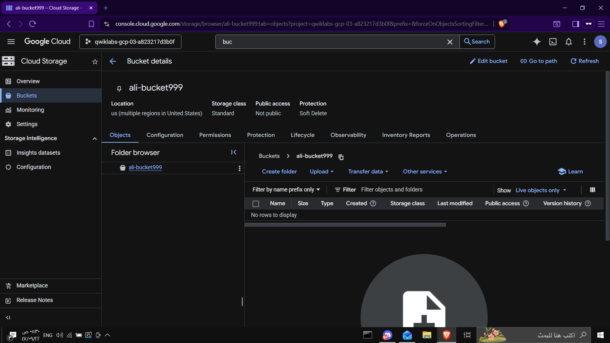
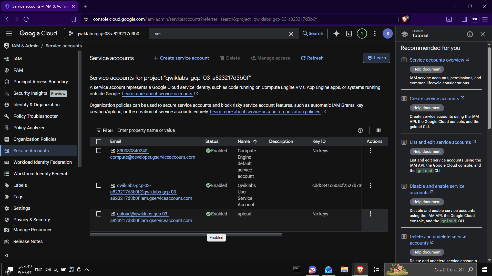
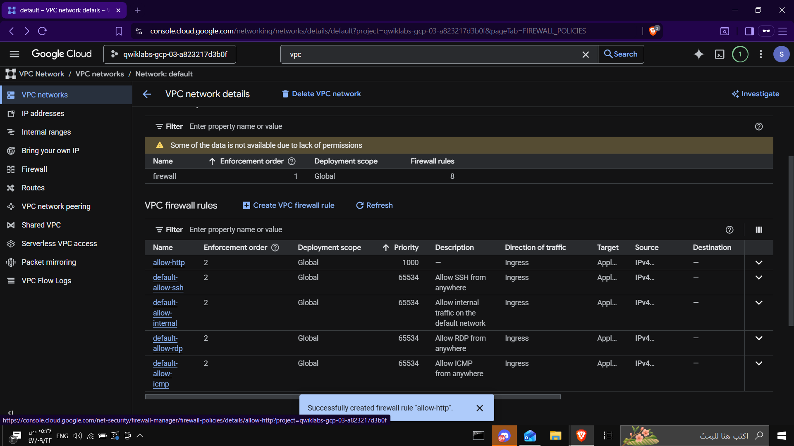
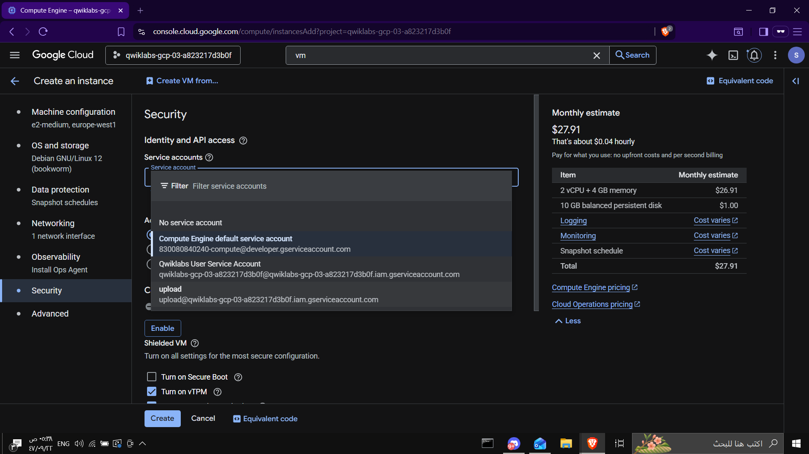
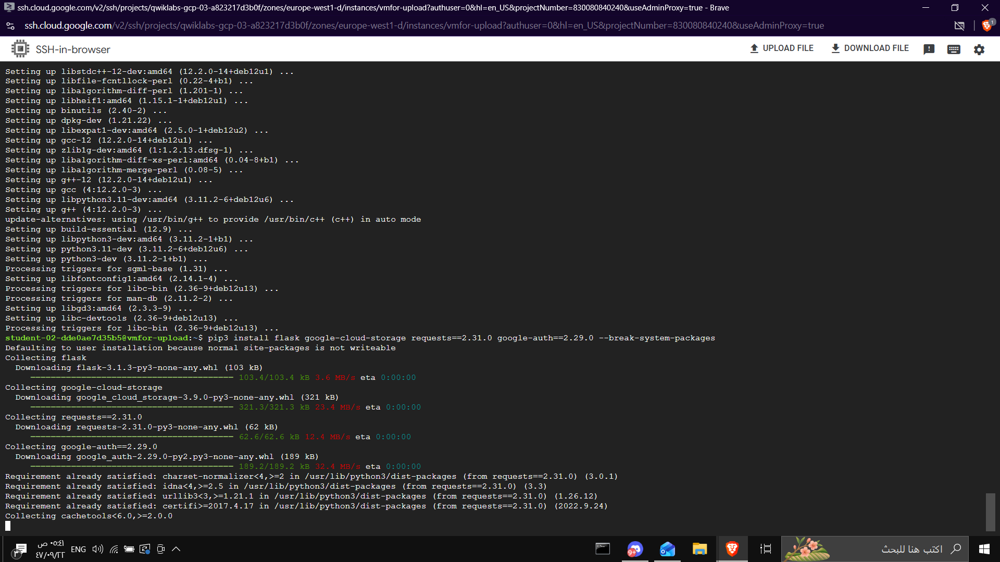
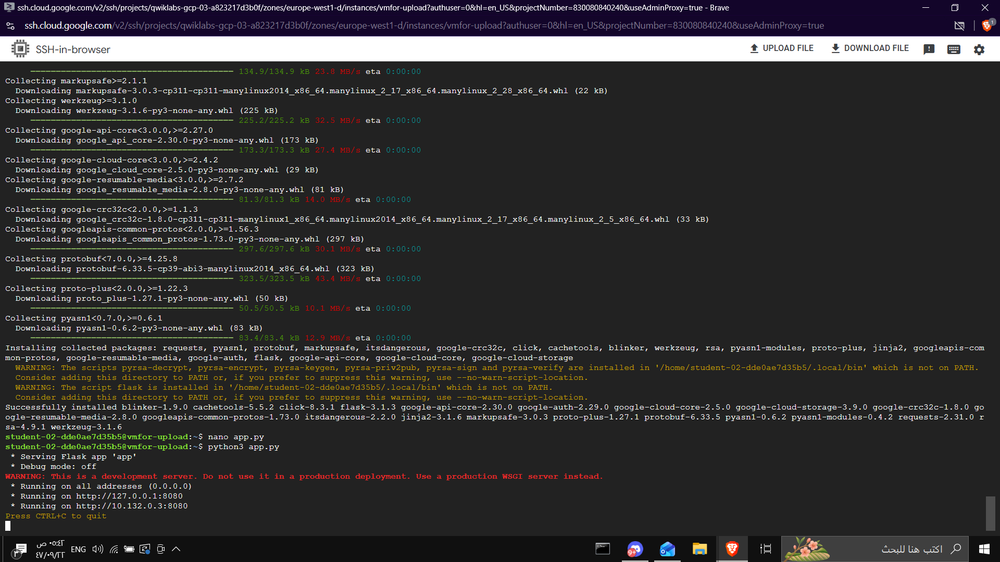
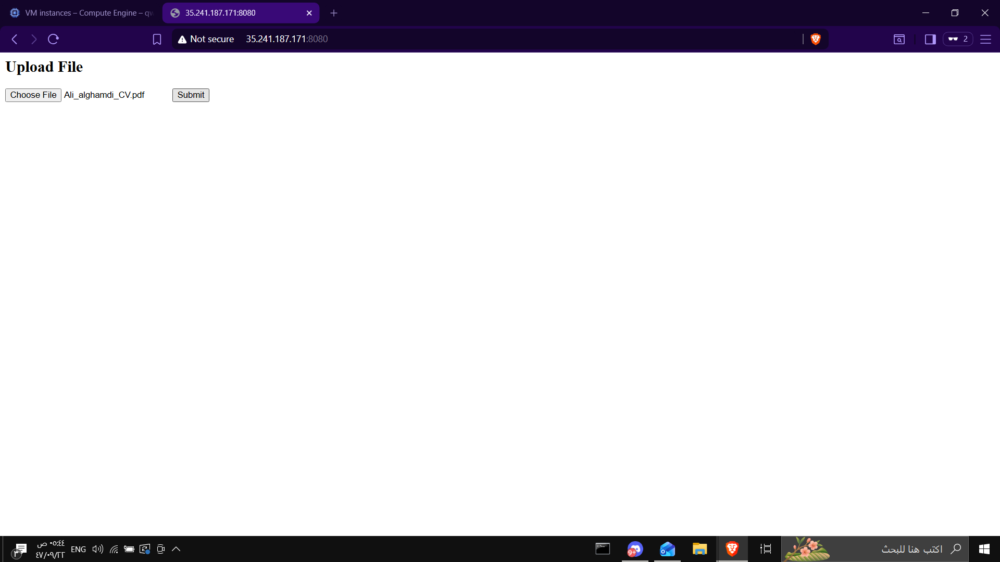
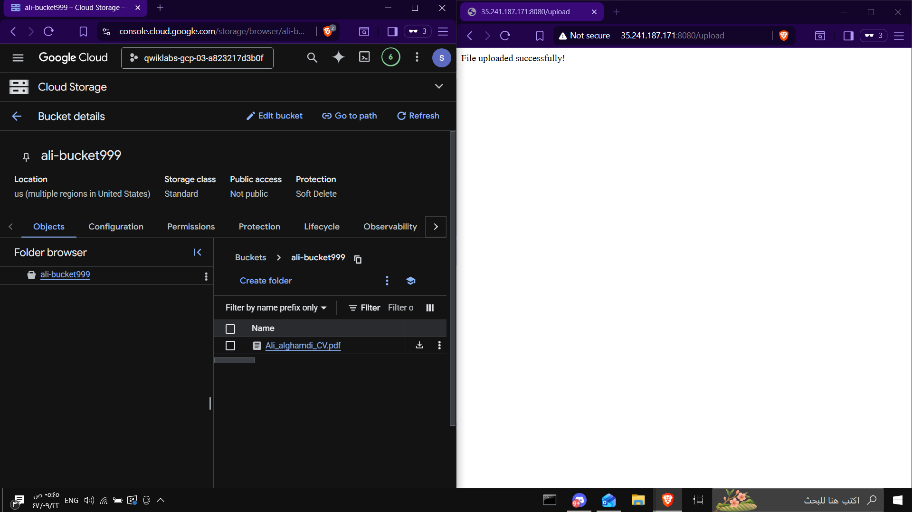

# Lab – File Upload Web App to Cloud Storage (GCP)

## Objective

Deploy a **simple web application** on a **Compute Engine VM** that allows users to upload files through a website.  
The uploaded files are stored securely in a **Google Cloud Storage bucket** using a **Service Account** instead of personal credentials.

This demonstrates secure access between Compute Engine and Cloud Storage.

---

# Architecture

User uploads file through the website.

```
User  
↓  
Web Browser  
↓  
Flask Web Application  
↓  
Compute Engine VM  
↓  
Service Account  
↓  
Cloud Storage Bucket
```

---

# Services Used

- Compute Engine
- Cloud Storage
- IAM & Service Accounts
- VPC Firewall
- Python Flask

---

# Step 1 – Create Cloud Storage Bucket

Create a bucket to store uploaded files.

Example bucket name:

```
ali-bucket999
```



---

# Step 2 – Create Service Account

Create a Service Account for the VM.

Service Account name:

```
upload
```

Grant role:

```
Storage Object Admin
```

This allows the VM to upload files to the bucket.



---

# Step 3 – Create Firewall Rule

Allow HTTP traffic to access the web application.

Firewall rule:

```
allow-http
```

Configuration:

- Protocol: TCP
- Port: 8080
- Direction: Ingress



---

# Step 4 – Create Compute Engine VM

Create a VM to host the web application.

Example configuration:

- Machine type: e2-medium
- OS: Debian Linux
- Service Account: upload



---

# Step 5 – Connect to VM (SSH)

Connect to the VM using **SSH-in-browser**.



---

# Step 6 – Prepare the Environment

Update the system and install Python and pip.

```bash
sudo apt update
sudo apt install python3 python3-pip -y
```

Install the required Python packages:

```bash
pip3 install flask google-cloud-storage requests==2.31.0 google-auth==2.29.0 --break-system-packages
```

---

# Step 7 – Create Flask Application

Create the web application file.

```bash
nano app.py
```

Paste the following code:

```python
from flask import Flask, request
from google.cloud import storage

app = Flask(__name__)

BUCKET_NAME = "ali-bucket999"

@app.route('/')
def index():
    return '''
    <h2>Upload File</h2>
    <form method="POST" action="/upload" enctype="multipart/form-data">
        <input type="file" name="file">
        <input type="submit">
    </form>
    '''

@app.route('/upload', methods=['POST'])
def upload():
    file = request.files['file']

    storage_client = storage.Client()
    bucket = storage_client.bucket(BUCKET_NAME)

    blob = bucket.blob(file.filename)
    blob.upload_from_file(file)

    return "File uploaded successfully!"

app.run(host='0.0.0.0', port=8080)
```

---

# Step 8 – Run the Web Application

Run the Flask server:

```bash
python3 app.py
```

Output:

```
Running on http://0.0.0.0:8080
```



---

# Step 9 – Access the Web Application

Open the VM external IP in the browser:

```
http://VM_EXTERNAL_IP:8080
```

Upload a file using the web interface.



---

# Step 10 – Verify File Upload

After uploading the file, verify that it appears inside the Cloud Storage bucket.



---

# Result

The web application successfully uploads files to **Google Cloud Storage** using a **Service Account** without exposing personal credentials.

This architecture follows Google Cloud security best practices.

---

# Key Learning Points

- Using **Service Accounts** instead of user credentials
- Secure communication between Compute Engine and Cloud Storage
- Deploying a simple **Flask web application**
- Configuring **VPC firewall rules**
- Uploading files programmatically to Cloud Storage
