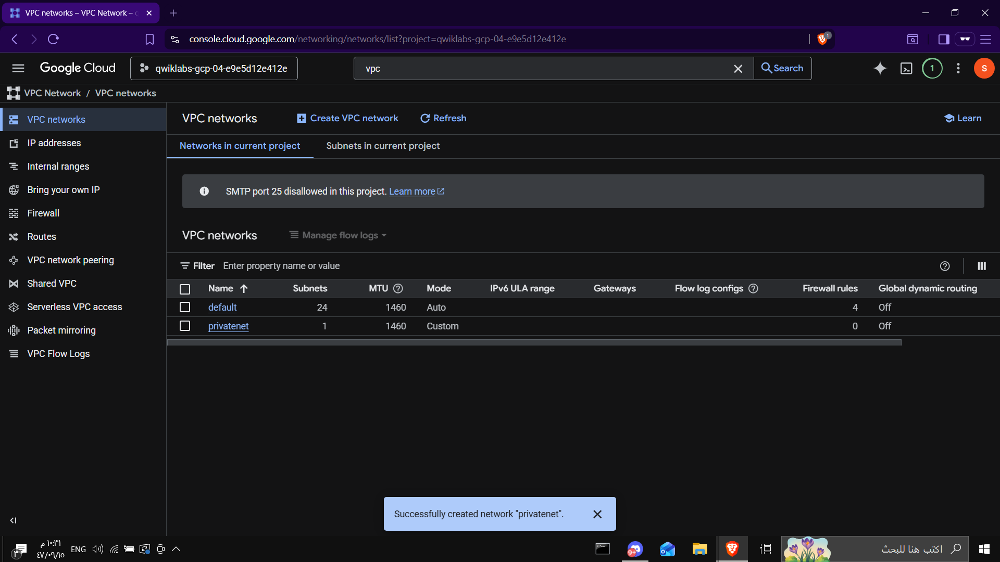
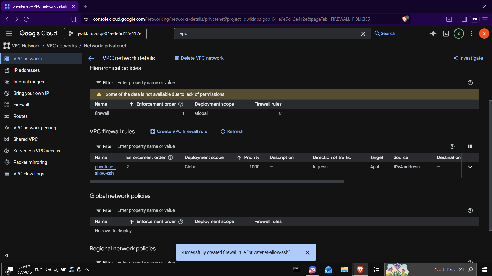
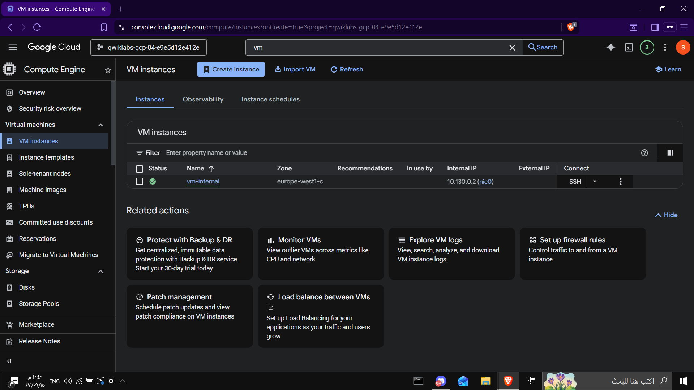
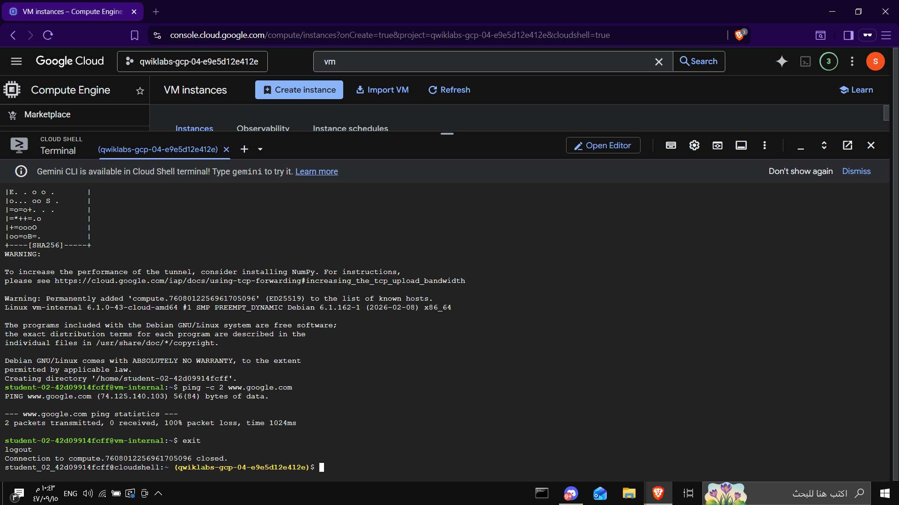
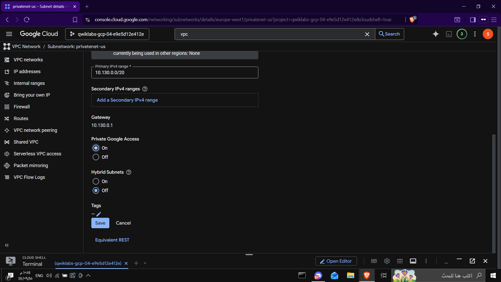
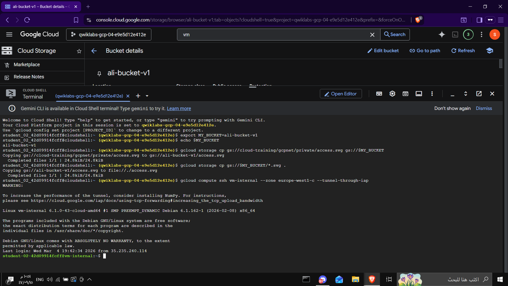
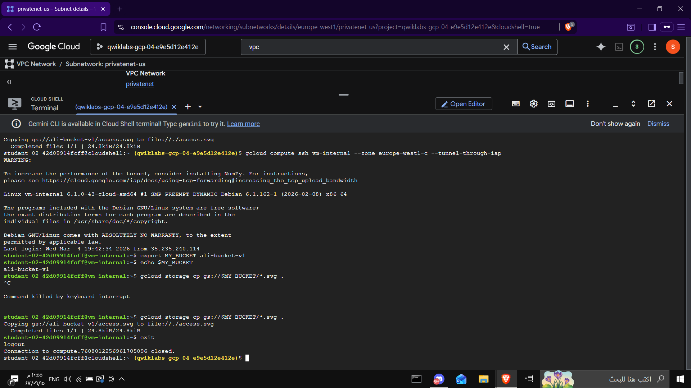
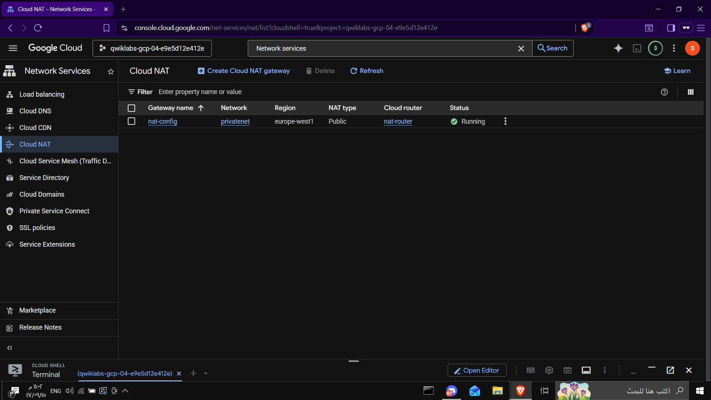

# Lab – Implement Private Google Access and Cloud NAT

## Objective

Learn how to allow a VM without a public IP address to securely access Google APIs and the internet using:

* Private Google Access
* Cloud NAT
* Identity-Aware Proxy (IAP)

---

## Architecture

VM (No Public IP)
↓
Private Google Access → Access Google APIs
↓
Cloud NAT → Access Internet

---

# Steps

## 1️⃣ Create VPC Network

Create a custom VPC network called:

privatenet

Create a subnet:

privatenet-us

CIDR range:

10.130.0.0/20

This network will host the internal VM used in this lab.



---

## 2️⃣ Create Firewall Rule (Allow SSH via IAP)

Create a firewall rule to allow SSH access using Google's IAP tunnel IP range.

Allow source range:

35.235.240.0/20

Allow port:

tcp:22

This allows secure SSH access to the internal VM through Identity-Aware Proxy.



---

## 3️⃣ Create VM Without External IP

Create a VM instance named:

vm-internal

Important configuration:

External IP = None

This ensures the VM is not directly accessible from the internet.



---

## 4️⃣ Connect to VM Using IAP Tunnel

Use Cloud Shell to connect to the VM using IAP:

```
gcloud compute ssh vm-internal --zone europe-west1-c --tunnel-through-iap
```

This allows secure SSH access without requiring a public IP address.



---

## 5️⃣ Enable Private Google Access

Enable Private Google Access on the subnet.

Navigation:

VPC Network → Subnets → privatenet-us

Set:

Private Google Access = ON

This allows instances without public IPs to reach Google APIs and services.



---

## 6️⃣ Test Private Google Access Using Cloud Storage

Create a Cloud Storage bucket and copy a test file.

Example commands:

```
export MY_BUCKET=ali-bucket-v1
gcloud storage cp gs://cloud-training/gcpnet/private/access.svg gs://$MY_BUCKET
```

Then download the file:

```
gcloud storage cp gs://$MY_BUCKET/*.svg .
```

If the transfer succeeds, the VM can access Google APIs through Private Google Access.



---

## 7️⃣ Verify File Transfer from Bucket

The VM successfully copied the file from the bucket.

This confirms:

* Private Google Access is working
* The VM can access Google services without a public IP



---

## 8️⃣ Configure Cloud NAT

Create a Cloud NAT gateway.

Configuration:

Gateway name:

nat-config

Router:

nat-router

Network:

privatenet

Region:

europe-west1

This allows internal VMs to access the internet without exposing them with public IPs.



---

# Result

The VM instance without an external IP can now:

* Connect securely using **Identity-Aware Proxy (IAP)**
* Access **Google APIs** using **Private Google Access**
* Access the **internet securely through Cloud NAT**

This architecture improves security by preventing direct public exposure of VM instances.
