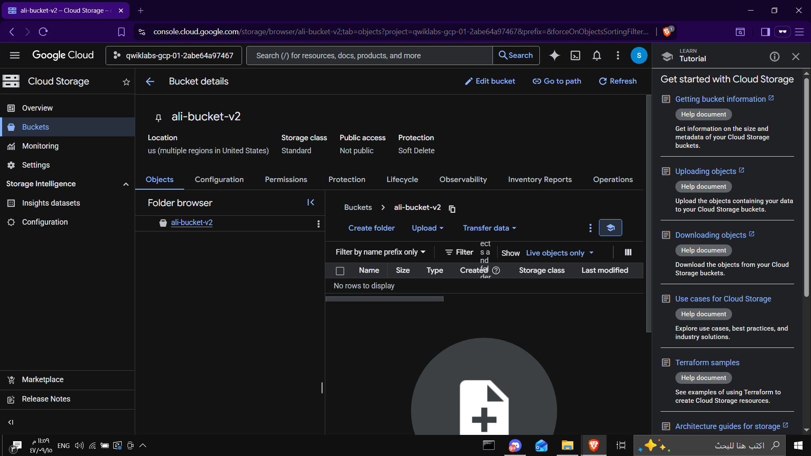
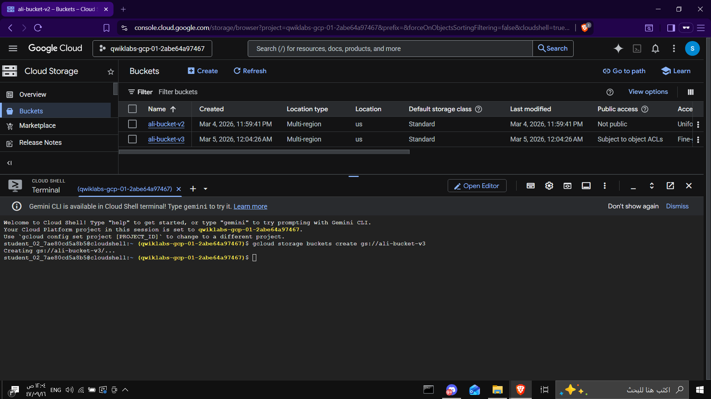
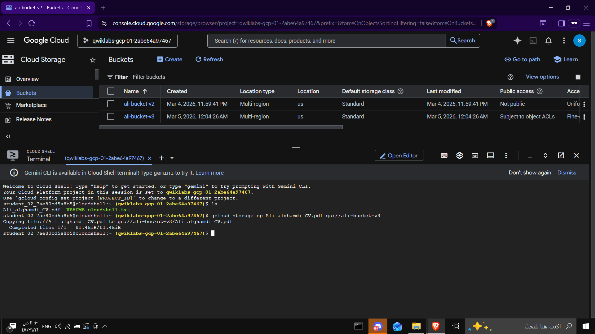
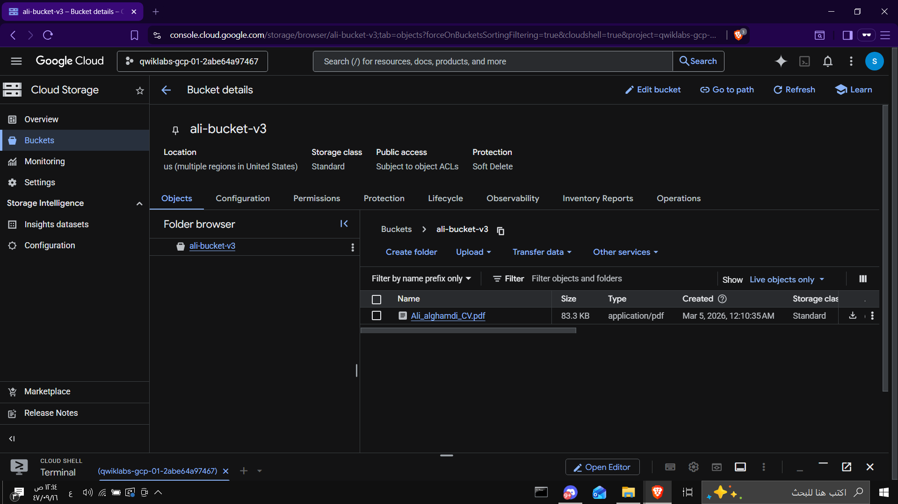
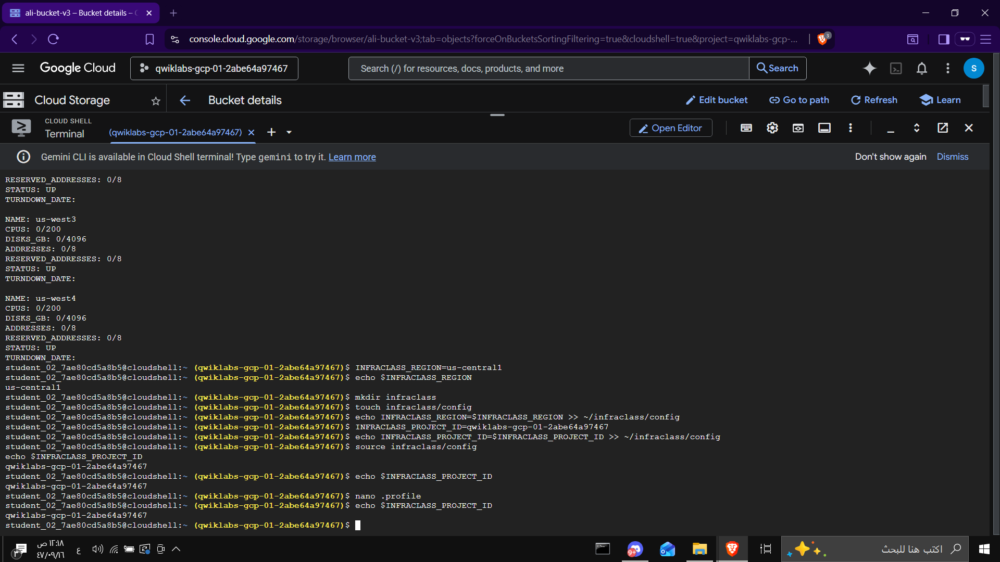

# Lab – Working with the Google Cloud Console and Cloud Shell

## Objective

In this lab we explore the two main environments in Google Cloud:

* **Google Cloud Console (GUI)** – Graphical interface
* **Cloud Shell (CLI)** – Command line interface

We learn how to create Cloud Storage buckets using both environments and understand basic Cloud Shell features.

---

## Architecture

User
↓
Google Cloud Console (GUI)
↓
Cloud Shell (CLI)
↓
Cloud Storage Buckets

---

# Steps

## 1️⃣ Create a Cloud Storage Bucket using the Cloud Console

Navigate to:

Navigation Menu → Cloud Storage → Buckets

Click **Create**.

Enter a globally unique bucket name.

Example:

ali-bucket-v2

Leave the other settings as default and click **Create**.

This creates a Cloud Storage bucket using the Google Cloud Console GUI.



---

## 2️⃣ Verify the Bucket in Cloud Storage

After creating the bucket, it appears in the Cloud Storage bucket list.

This confirms the bucket was successfully created.



---

## 3️⃣ Access Cloud Shell

Open **Cloud Shell** from the top-right of the console.

Cloud Shell provides:

* Temporary Compute Engine VM
* Pre-installed Cloud SDK
* Command-line access to Google Cloud
* 5 GB persistent storage

Cloud Shell allows managing Google Cloud resources using CLI commands.



---

## 4️⃣ Create a Bucket using Cloud Shell

Use the following command to create another bucket from the command line:

```bash
gcloud storage buckets create gs://ali-bucket-v3
```

This creates a new Cloud Storage bucket using CLI instead of the console.



---

## 5️⃣ Upload a File to the Bucket

Upload a local file from Cloud Shell to the bucket.

Example command:

```bash
gcloud storage cp Ali_alghamdi_CV.pdf gs://ali-bucket-v3
```

This command copies the file from Cloud Shell into the Cloud Storage bucket.



---

# Result

In this lab we successfully:

* Created a Cloud Storage bucket using **Cloud Console**
* Created another bucket using **Cloud Shell**
* Uploaded a file to **Cloud Storage**
* Explored basic **Cloud Shell features**

This demonstrates how Google Cloud supports both **GUI-based management** and **command-line automation**.
