# The Secure Evidence Vault

A hands-on Google Cloud lab focused on building a secure digital evidence storage workflow using **Custom VPC**, **IAM Service Accounts**, **Cloud Storage Archive**, **Soft Delete**, **Selective Object Sharing**, and **Signed URLs**.

---

## Overview

In this lab, I built a secure evidence storage solution for a digital forensics use case. The objective was to store sensitive case files in Google Cloud while applying key security best practices, including:

- avoiding personal credentials on the VM
- using a dedicated **Service Account**
- storing long-term files in the **Archive** storage class
- protecting deleted files with **Soft Delete**
- sharing only selected objects when needed
- generating temporary secure access through **Signed URLs**

---

## Notes

Some values may vary between lab sessions, such as:

- project ID
- bucket name
- service account email
- student account name

Replace these values with the ones assigned to your own lab environment.

---

## Lab Objectives

By the end of this lab, I was able to:

- Create a **Custom VPC** and subnet
- Configure an SSH firewall rule
- Create a **Service Account** for object uploads
- Assign the **Storage Object Creator** role
- Create a Cloud Storage bucket with:
  - **Multi-region**
  - **Archive** storage class
  - **Soft Delete**
- Deploy a VM attached to the Service Account
- Upload, delete, and restore a file
- Configure **selective sharing** for one file only
- Generate a **Signed URL** for temporary access to a private file

---

## Architecture

### Components Used

- **VPC**: `evidence-vpc`
- **Subnet**: `evidence-subnet`
- **Firewall Rule**: `allow-ssh-web`
- **Service Account**: `uploader-bot`
- **VM**: `evidence-web-server`
- **Bucket**: `my-lab-20011`

### Files Used

- `admin_evidence.txt`
- `shared.txt`
- `private.txt`

---

## Why This Design?

### Custom VPC
A **Custom VPC** was used to isolate and control the network environment instead of relying on the default network.

### Service Account
A dedicated **Service Account** was attached to the VM so it could interact with Cloud Storage without using personal user credentials.

### Storage Object Creator
The **Storage Object Creator** role was assigned to follow the **principle of least privilege**. The VM only needed permission to upload objects, not to manage the entire bucket.

### Archive Storage Class
The **Archive** storage class was selected because evidence files are usually stored for long periods and accessed infrequently.

### Soft Delete
**Soft Delete** was enabled to protect against accidental deletion and allow recovery of important files.

### Fine-Grained Object Access
**Fine-grained access control** was used to allow one file to be shared publicly while keeping another file private.

### Signed URL
A **Signed URL** was used to provide temporary access to a private object without exposing it permanently to the public.

---

## Implementation Steps

## 1) Create the Custom VPC

Created a custom VPC named `evidence-vpc` with one subnet.

### Configuration

- **VPC name**: `evidence-vpc`
- **Subnet mode**: `Custom`
- **Subnet name**: `evidence-subnet`
- **Region**: `us-central1`
- **IPv4 range**: `10.0.1.0/24`

### Screenshot
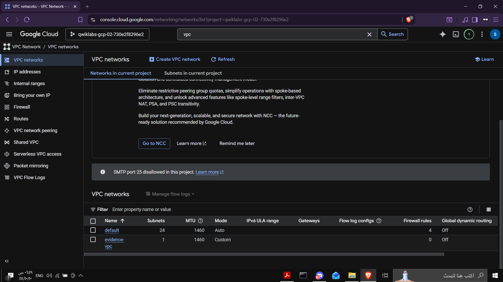

---

## 2) Create the Firewall Rule

Created a firewall rule to allow SSH access to instances in the VPC.

### Configuration

- **Name**: `allow-ssh-web`
- **Network**: `evidence-vpc`
- **Direction**: `Ingress`
- **Targets**: All instances in the network
- **Source IPv4 ranges**: `0.0.0.0/0`
- **Protocol / Port**: `tcp:22`

### Screenshot
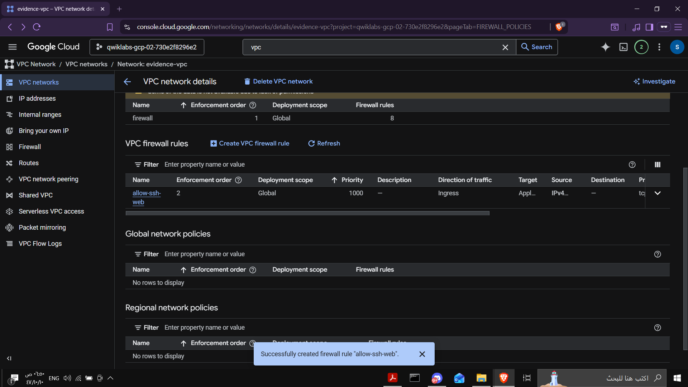

---

## 3) Create the Service Account

Created a Service Account named `uploader-bot` and assigned the **Storage Object Creator** role.

### Why This Role?
This role allows object uploads while avoiding broader permissions such as object deletion or full bucket administration.

---

## 4) Create the Cloud Storage Bucket

Created the bucket `my-lab-20011` with the following settings:

- **Location type**: `Multi-region`
- **Location**: `US`
- **Storage class**: `Archive`
- **Soft Delete**: Enabled

### Screenshot
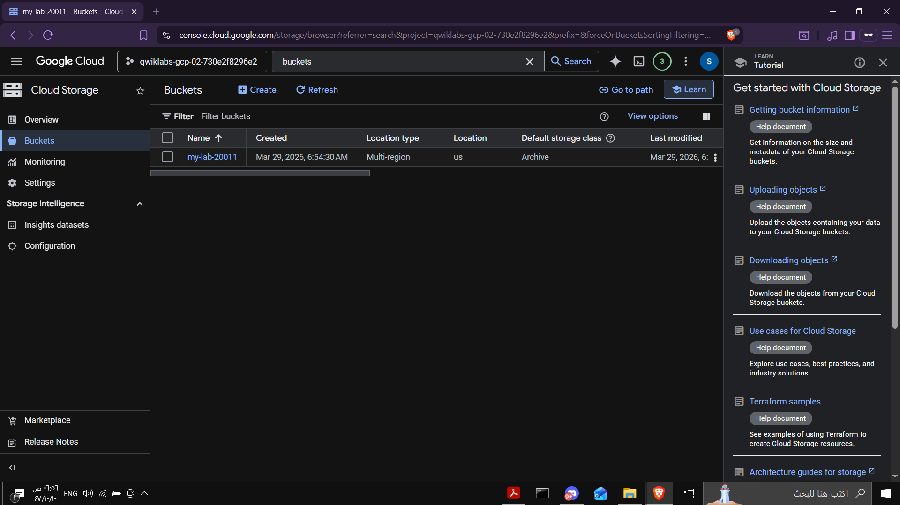

---

## 5) Deploy the VM

Created the VM `evidence-web-server` and attached the `uploader-bot` Service Account.

### Important Configuration
The VM also required proper API access in order to interact successfully with Cloud Storage.

### Screenshots
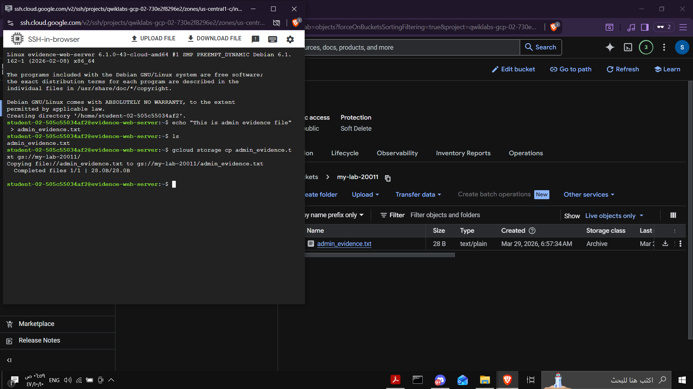
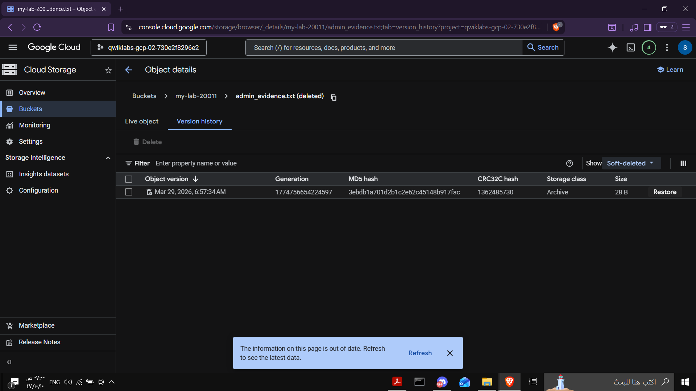

---

## 6) Upload the Initial Evidence File

Connected to the VM through SSH and created the file `admin_evidence.txt`.

### Commands Used

```bash
echo "This is admin evidence file" > admin_evidence.txt
ls
gcloud storage cp admin_evidence.txt gs://my-lab-20011/
gcloud storage ls gs://my-lab-20011/
```

### What This Does

- creates the evidence file
- verifies it exists locally
- uploads it to the bucket
- confirms the upload

### Screenshot
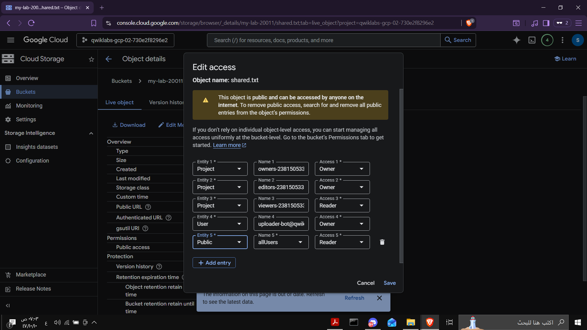

---

## 7) Delete and Restore the File

Deleted `admin_evidence.txt` from the bucket and restored it from **Version history / Soft-deleted objects**.

### Why This Matters

This demonstrates that deleted evidence can be recovered instead of being permanently lost immediately.

### Screenshot
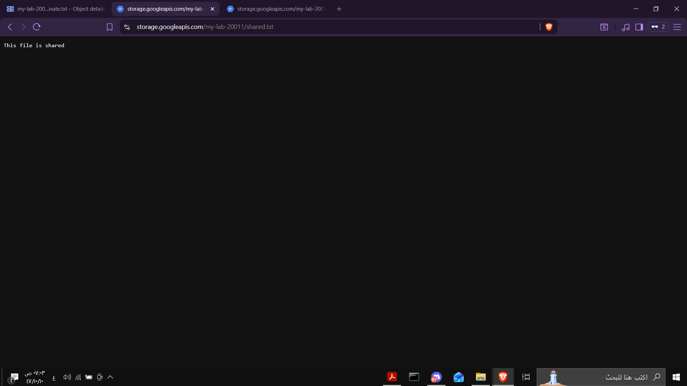

---

## 8) Upload Files for Selective Sharing

Created two files:

- one to be shared publicly
- one to remain private

### Commands Used

```bash
echo "This file is shared" > shared.txt
echo "This file is private" > private.txt

gcloud storage cp shared.txt gs://my-lab-20011/
gcloud storage cp private.txt gs://my-lab-20011/
gcloud storage ls gs://my-lab-20011/
```

### What This Does

- creates both files
- uploads them to Cloud Storage
- confirms that both objects exist in the bucket

### Screenshot
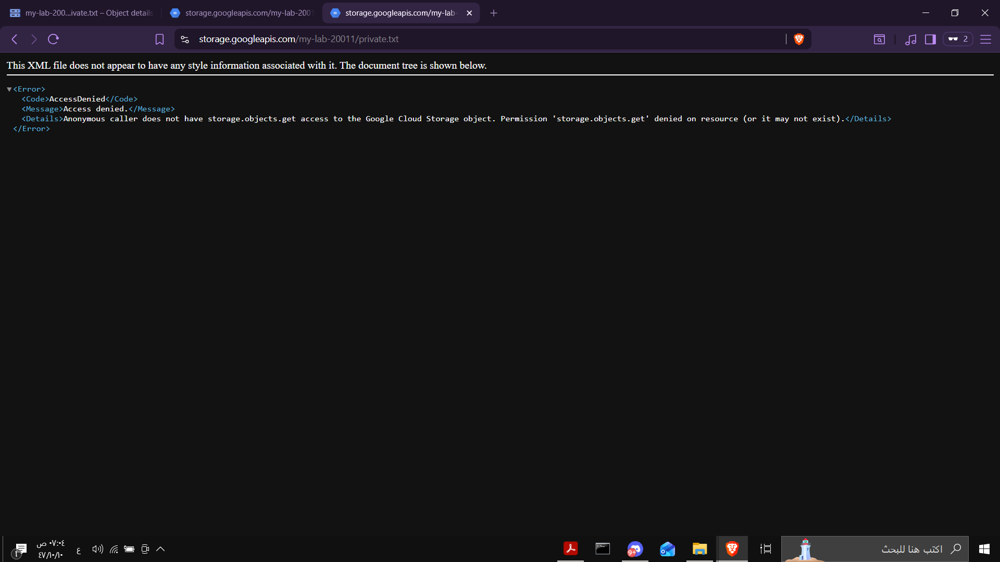

---

## 9) Configure Object-Level Access

To share only one object, the bucket-level access configuration had to be adjusted first.

### Changes Made

- switched **Uniform bucket-level access** to **Fine-grained**
- removed **Public Access Prevention**
- granted public read access only to `shared.txt`

### Public Object Permission

- **Entity**: `allUsers`
- **Access**: `Reader`

### Screenshot
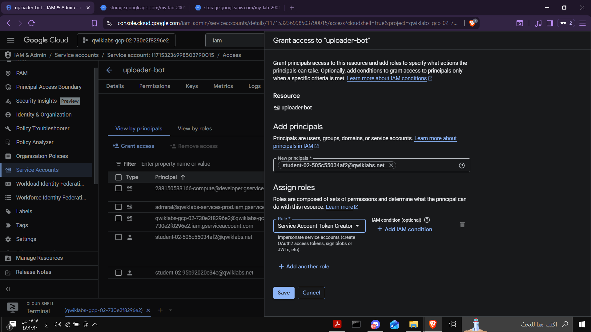

---

## 10) Verify Selective Sharing

Opened both files in the browser.

### Expected Result

- `shared.txt` should open successfully
- `private.txt` should return **Access Denied**

### Public File URL

```text
https://storage.googleapis.com/my-lab-20011/shared.txt
```

### Private File URL

```text
https://storage.googleapis.com/my-lab-20011/private.txt
```

### Screenshots
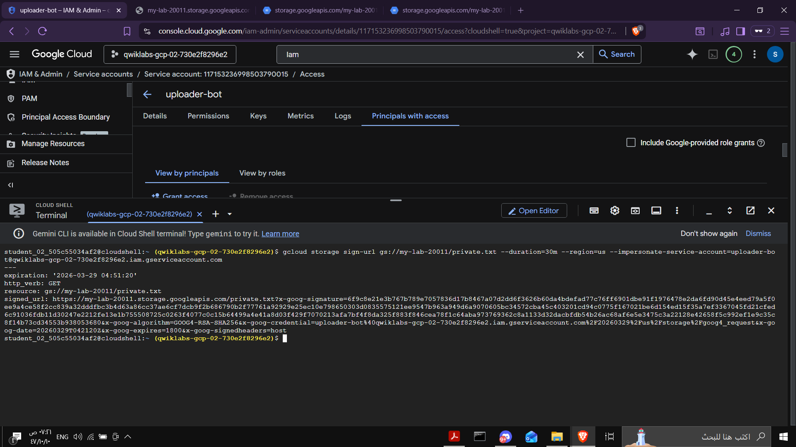
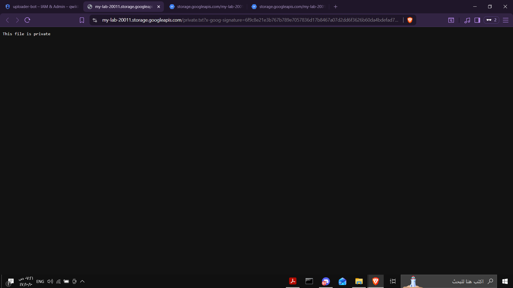

---

## 11) Generate a Signed URL for the Private File

The private file should remain private, but it still needed to be accessible temporarily.

### Final Working Command

```bash
gcloud storage sign-url gs://my-lab-20011/private.txt \
  --duration=30m \
  --region=us \
  --impersonate-service-account=uploader-bot@qwiklabs-gcp-02-730e2f8296e2.iam.gserviceaccount.com
```

### What This Command Does

- creates a temporary signed link
- allows secure access to `private.txt`
- keeps the object itself private
- expires automatically after 30 minutes

### Result

The generated Signed URL successfully opened `private.txt` in the browser.

### Screenshot


---

## Troubleshooting Notes

This lab included several real-world troubleshooting moments.

### 1. VM Upload Initially Failed
Even with the correct IAM role, the VM also needed proper API access configuration to interact with Cloud Storage.

### 2. Object Sharing Was Blocked
Selective sharing did not work until:

- **Uniform bucket-level access** was switched to **Fine-grained**
- **Public Access Prevention** was removed

### 3. Signed URL Creation Initially Failed
Generating the Signed URL required:

- using the correct **Service Account**
- using **service account impersonation**
- specifying the bucket region with `--region=us`

These issues were valuable because they reflect common real-world cloud troubleshooting scenarios.

---

## Commands Summary

### Create and Upload the Initial Evidence File

```bash
echo "This is admin evidence file" > admin_evidence.txt
gcloud storage cp admin_evidence.txt gs://my-lab-20011/
gcloud storage ls gs://my-lab-20011/
```

### Create and Upload Files for Selective Sharing

```bash
echo "This file is shared" > shared.txt
echo "This file is private" > private.txt

gcloud storage cp shared.txt gs://my-lab-20011/
gcloud storage cp private.txt gs://my-lab-20011/
gcloud storage ls gs://my-lab-20011/
```

### Public Object Test

```text
https://storage.googleapis.com/my-lab-20011/shared.txt
```

### Private Object Test

```text
https://storage.googleapis.com/my-lab-20011/private.txt
```

### Signed URL Command

```bash
gcloud storage sign-url gs://my-lab-20011/private.txt \
  --duration=30m \
  --region=us \
  --impersonate-service-account=uploader-bot@qwiklabs-gcp-02-730e2f8296e2.iam.gserviceaccount.com
```

---

## Key Concepts Practiced

- Custom VPC
- Firewall rules
- Service Accounts
- Least privilege IAM
- Archive storage
- Soft Delete
- Object-level permissions
- Public vs private object access
- Signed URLs
- Service account impersonation

---

## Final Outcome

This lab demonstrated how to build a secure cloud storage workflow for sensitive evidence files using multiple Google Cloud services together.

It covered:

- networking
- identity and access management
- storage lifecycle protection
- selective sharing
- temporary secure access

Overall, this was a strong hands-on exercise for understanding how Google Cloud security and storage services work together in a practical and realistic scenario.
