# Lab – VPC Networking

## Objective

Learn how to configure networking in **Google Cloud VPC** by performing the following:

- Explore the default VPC network
- Create an auto mode VPC network
- Convert the network to custom mode
- Create additional custom VPC networks
- Configure firewall rules
- Create VM instances
- Test connectivity across VPC networks

---

# Architecture

VPC Networks used in this lab:

- mynetwork
- managementnet
- privatenet

VM Instances:

- mynet-us-vm
- mynet-notus-vm
- managementnet-us-vm
- privatenet-us-vm

These networks are isolated unless configured with **VPC peering or VPN**.

---

# Steps

---

## 1️⃣ Explore Default VPC Network

Every Google Cloud project starts with a **default VPC network** that includes:

- Subnets in each region
- Routes
- Firewall rules

### View Routes

Routes define how traffic moves inside the network and to the internet.

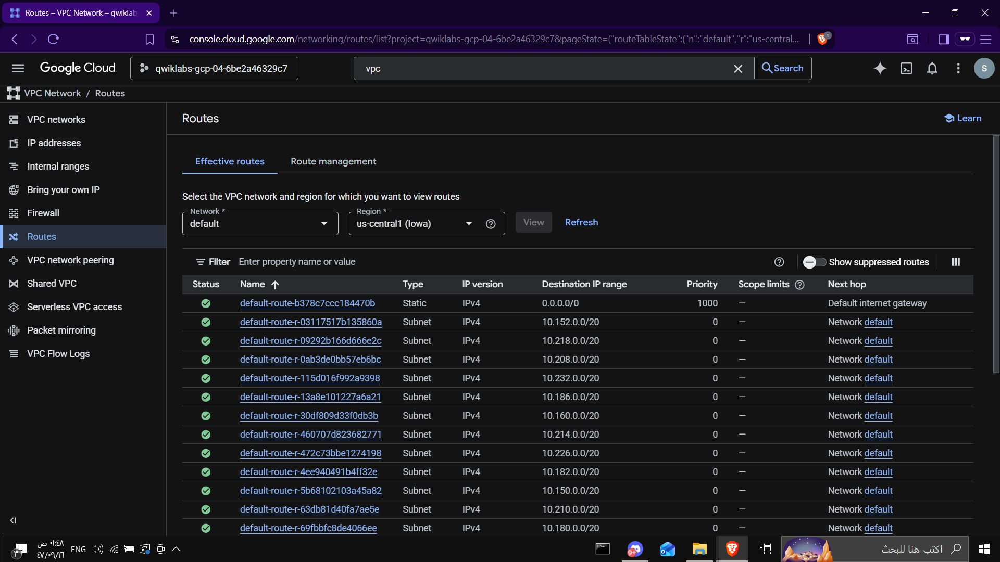

---

### View Firewall Rules

Default firewall rules include:

- allow ICMP
- allow SSH
- allow RDP
- allow internal traffic

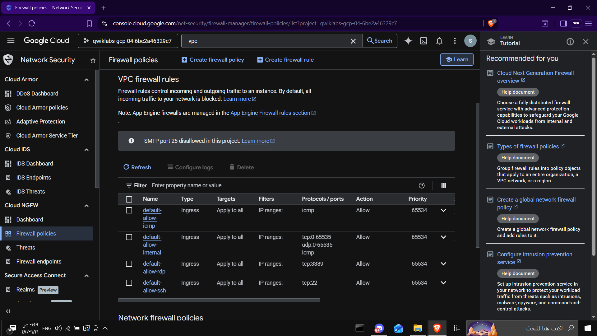

---

## 2️⃣ Create an Auto Mode VPC Network

Create a new VPC network:

```
Name: mynetwork
Subnet mode: Automatic
```

Auto mode automatically creates subnets in every region.

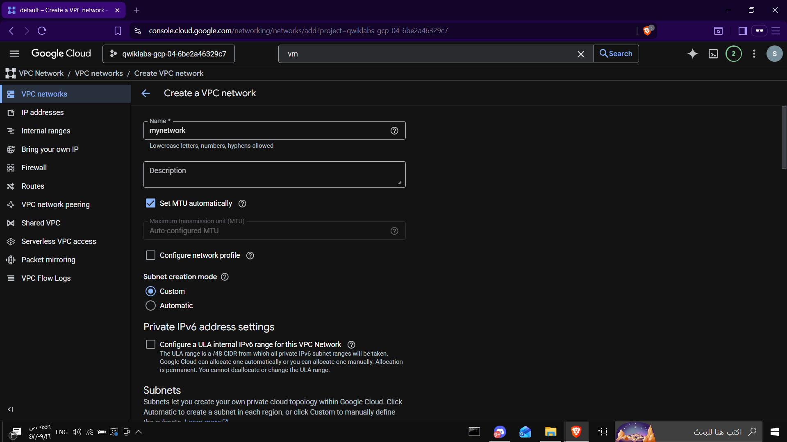

---

### Verify VPC Network

After creation, the network appears with multiple regional subnets.

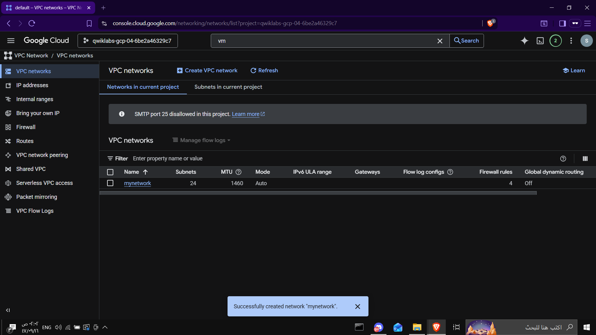

---

## 3️⃣ Create VM Instances

Create two VM instances in different regions.

VM 1:

```
Name: mynet-us-vm
Region: Region 1
Machine type: e2-medium
OS: Debian 12
```

VM 2:

```
Name: mynet-notus-vm
Region: Region 2
Machine type: e2-medium
OS: Debian 12
```

Networking tag used:

```
iap-gce
```

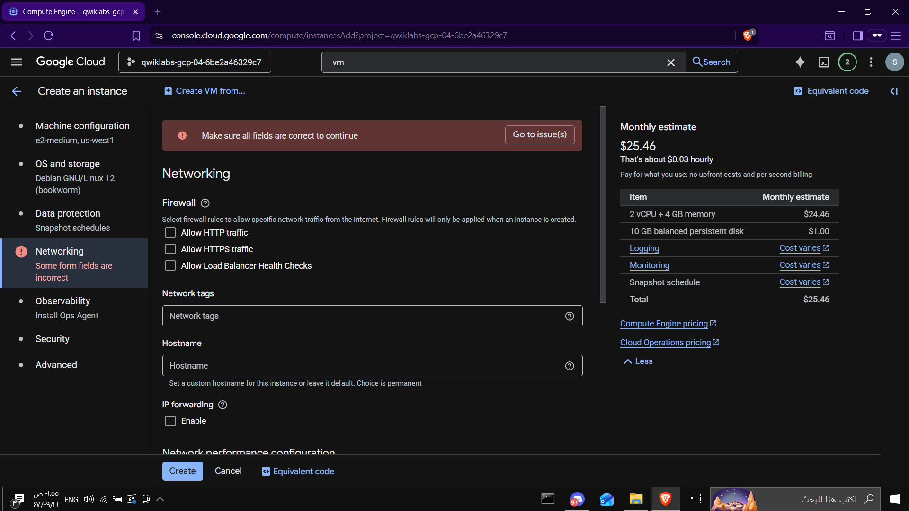

---

### Verify VM Instances

Two instances are created in different regions.

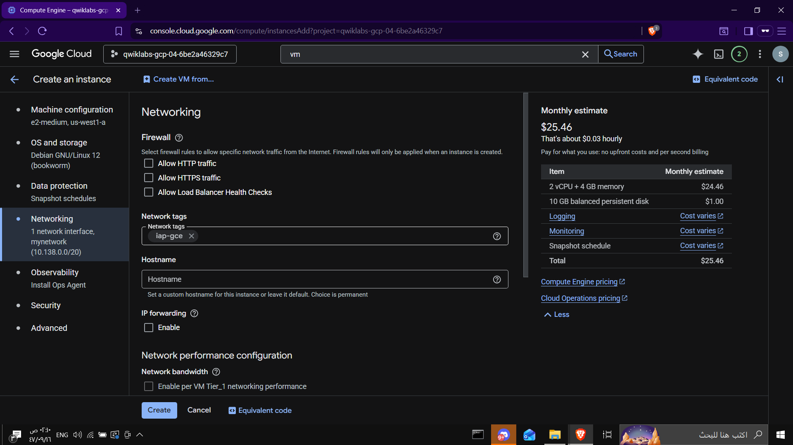

---

## 4️⃣ Test Connectivity

SSH into the VM using IAP:

```
gcloud compute ssh mynet-us-vm \
--zone=ZONE \
--tunnel-through-iap
```

Then test connectivity using **ping**.

Example:

```
ping -c 3 <internal-ip>
```

Successful response confirms connectivity.

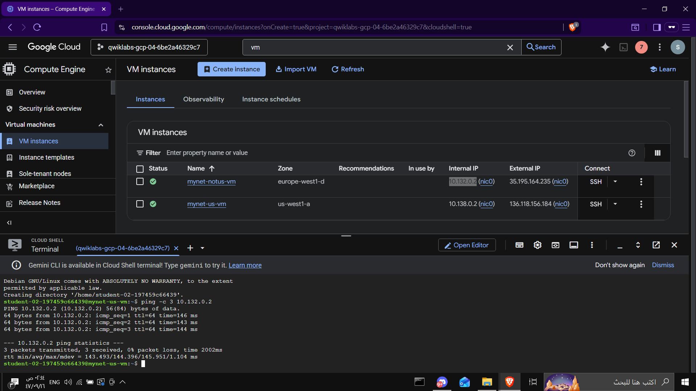

---

### Ping External IP

Test connectivity using the public IP.

```
ping -c 3 <external-ip>
```

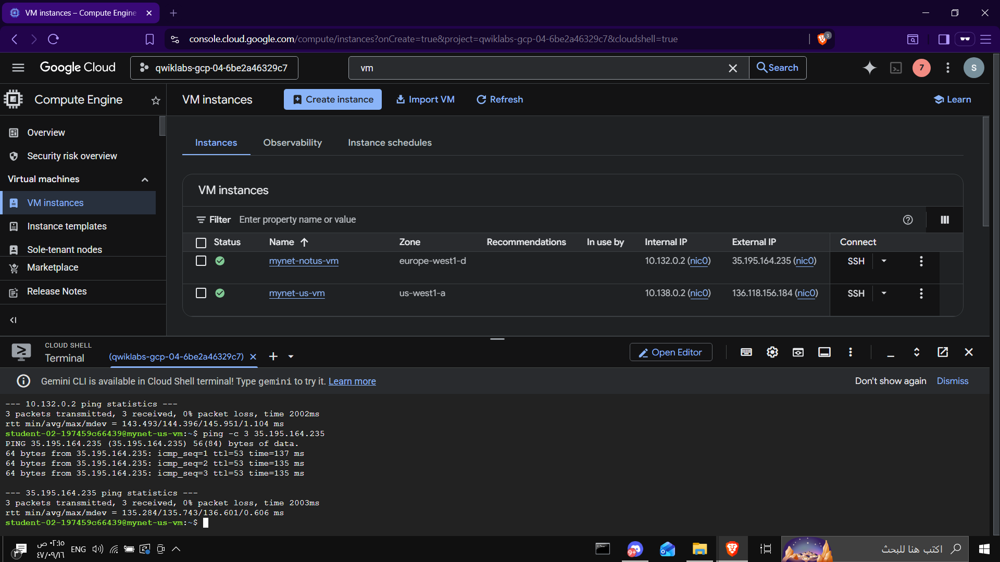

---

## 5️⃣ Create Custom VPC Networks

Create two additional networks.

### managementnet

Subnet:

```
managementsubnet-us
10.240.0.0/20
```

Firewall rule:

```
managementnet-allow-icmp-ssh-rdp
```

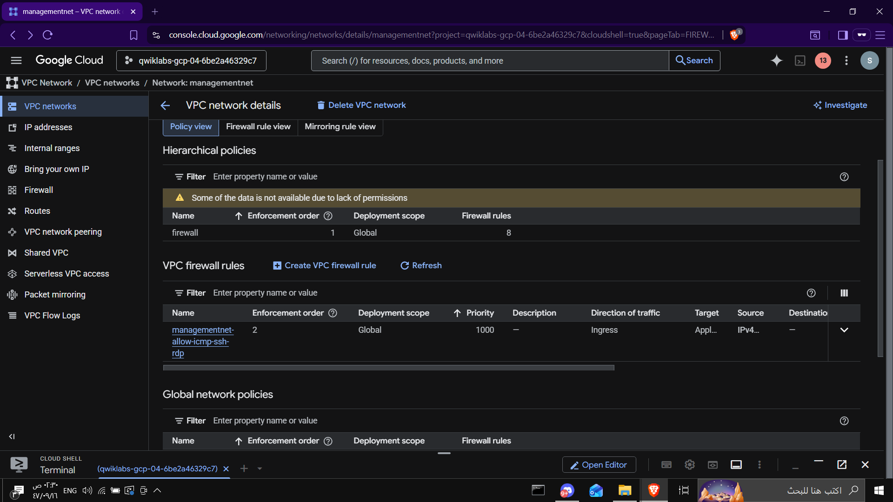

---

### privatenet

Created using **gcloud CLI**

```
gcloud compute networks create privatenet --subnet-mode=custom
```

Create subnets:

```
gcloud compute networks subnets create privatesubnet-us \
--network=privatenet \
--region=us-west1 \
--range=172.16.0.0/24
```

```
gcloud compute networks subnets create privatesubnet-notus \
--network=privatenet \
--region=europe-west1 \
--range=172.20.0.0/20
```

Verify networks:

```
gcloud compute networks list
```

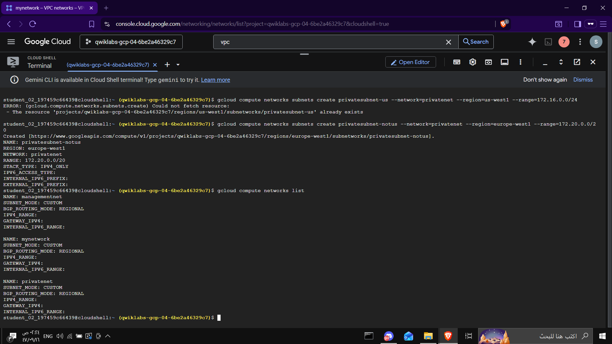

---

## 6️⃣ Create VM in privatenet

Create VM using CLI:

```
gcloud compute instances create privatenet-us-vm \
--zone=ZONE \
--machine-type=e2-micro \
--subnet=privatesubnet-us \
--image-family=debian-12 \
--image-project=debian-cloud
```

Verify instances:

```
gcloud compute instances list
```

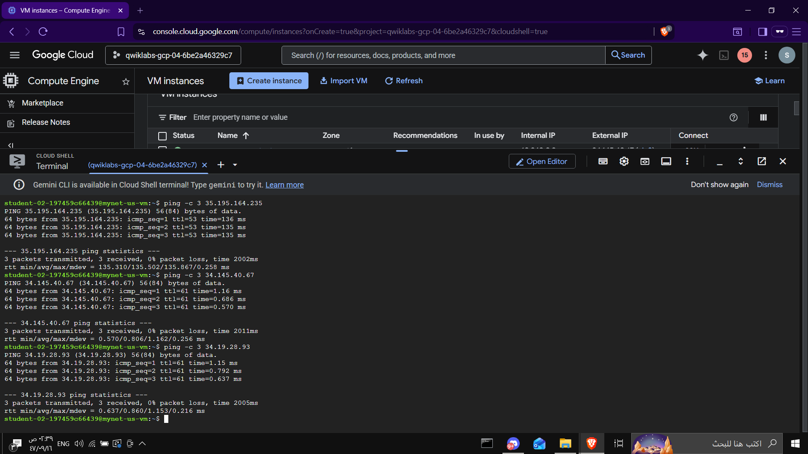

---

# Connectivity Results

### External IP

All VM instances can reach each other using **external IP addresses**.

Reason:

Firewall rules allow ICMP from:

```
0.0.0.0/0
```

---

### Internal IP

Internal communication works **only within the same VPC network**.

Example:

```
mynet-us-vm → mynet-notus-vm  ✅
```

But:

```
mynet-us-vm → managementnet-us-vm ❌
mynet-us-vm → privatenet-us-vm ❌
```

Reason:

Each VPC network is **isolated by default**.

---

# Result

At the end of this lab we successfully:

- Created an **auto mode VPC network**
- Converted it to **custom mode**
- Created additional VPC networks
- Configured **firewall rules**
- Created multiple **VM instances**
- Tested **network connectivity**
